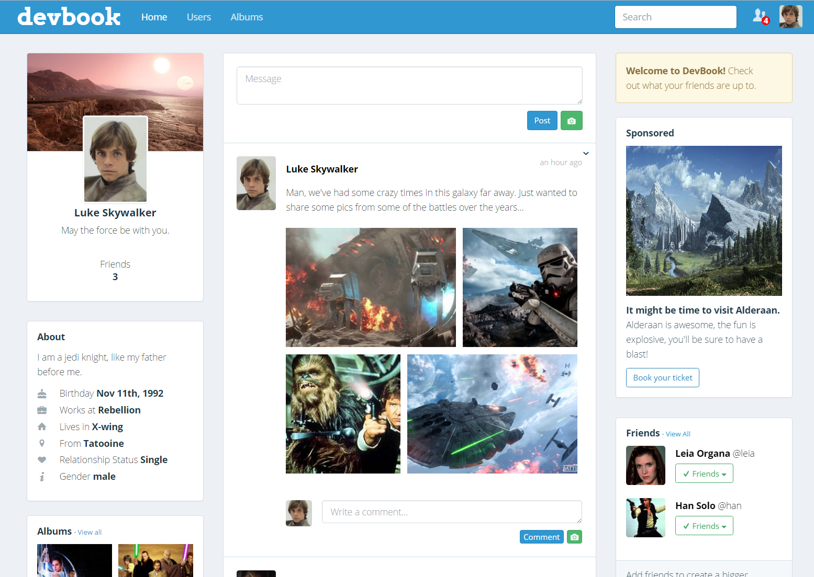
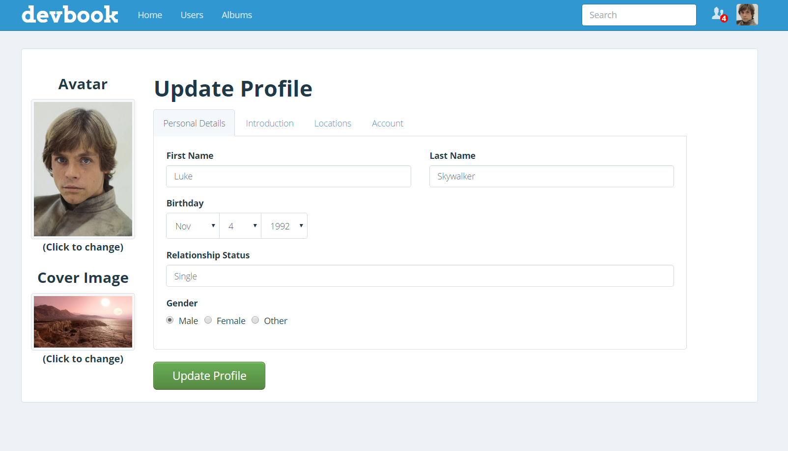
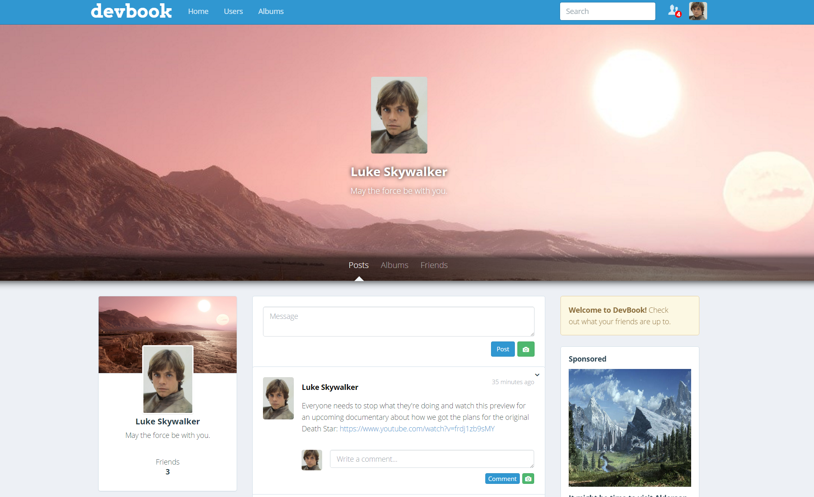
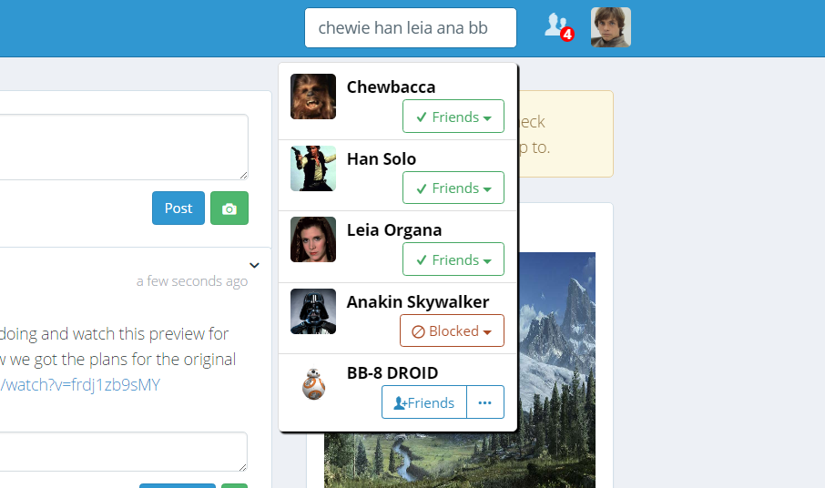
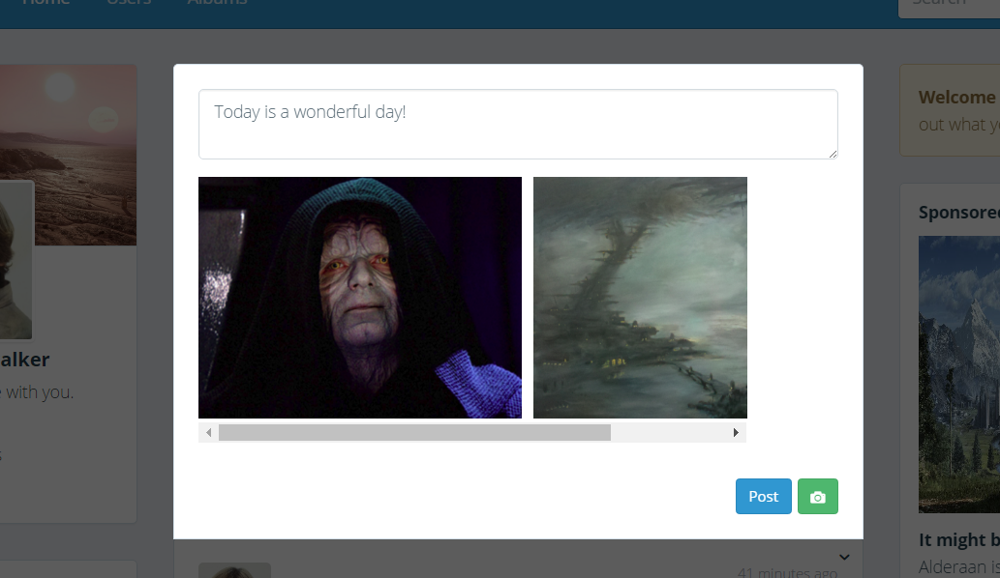
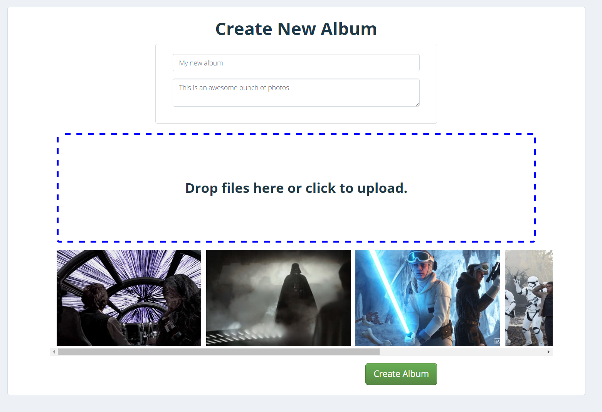
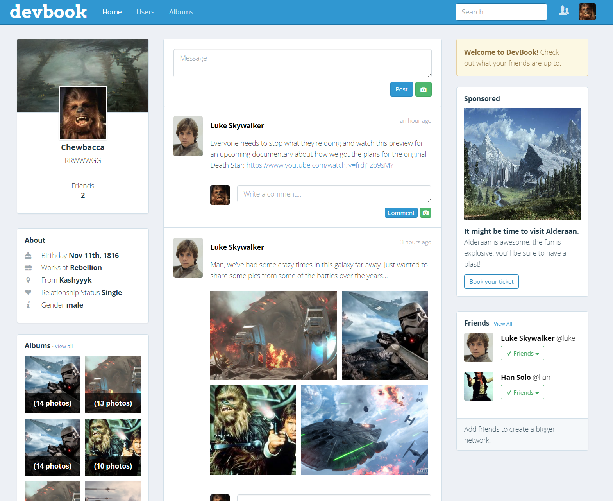
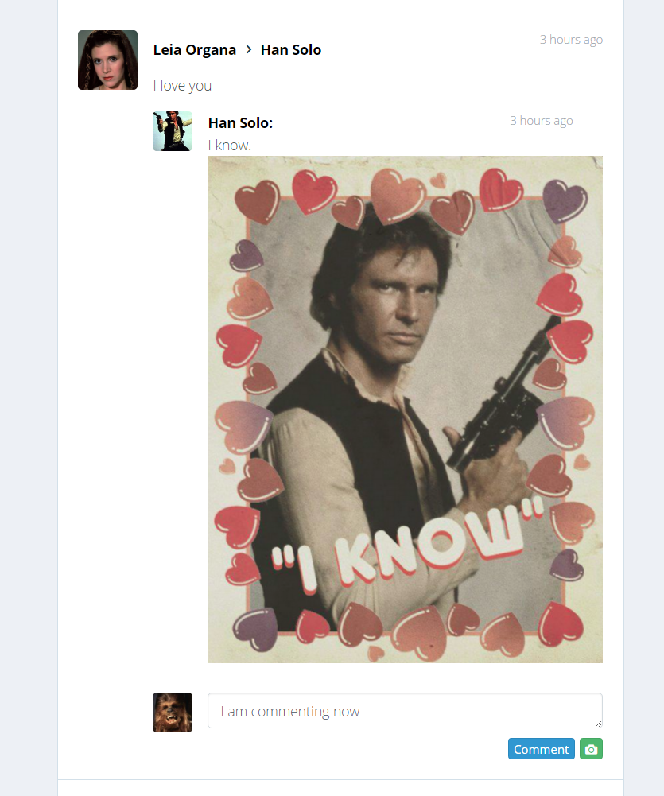

# DevBook

[DevBook live][heroku]

[heroku]: http://www.devbook.us
[development-readme]: ./docs/readme.md

[DevBook](http://www.devbook.us) is a social networking site similar to Facebook.  Users can find and add friends, post status updates and images, and comment on these items.  Users see a feed that shows status updates and other activities of their friends and selves.

[DevBook](http://www.devbook.us) is a personal project of Todd Nestor.

## Features

### Customize profiles with personal details and images

  Users can customize their profile information and view other users' profiles.

  

  

### Search for friends and send friend requests

  Users can search for other users and send friend requests to them.

  

### Post status updates that can optionally include one or many images

  Users can post status updates that include images.

  

### Create photo albums

  Users can create photo albums.

  

### View a personalized feed of friends' status updates and other activities

  Users can view a feed of friends' status updates and other activities.  The feed  will load more items when a user scrolls to the bottom of the feed.

  

### Comment on any activity or status update and include an optional picture on comments

  Users can comment on status updates and other activities and optionally include an image in their comment.

  

### Other features
* Automatic linking of any URLs entered in status updates and comments.
* User's can have multiple sessions so they can be logged in from multiple devices and logging out of one doesn't log them out of the others.
* User's can block other users.  If a user is blocked by another user they never see the user blocking them in search results or user lists.

## Product Design

DevBook was built in two weeks including the creating the [development plan][development-readme].  The [development plan][development-readme] includes the estimated timeline, planned database schema, along with the original wireframes and other planning documents.

## Technology

DevBook utilizes Ruby on Rails for the back end API and React.js for the front end.

### Front end
DevBook is a single page app.

The following is a list of some of the technologies used to create the DevBook front end.

* **React.js** is the framework used for the entirety of the front end.
* **React Router** is used to update the view based on the URL path.
* **Redux** is utilized to store the bulk of the data needed on the client-side, and to trigger API calls as needed.
* **React Sweet Alert** is used for alerting the user and asking for confirmation of dangerous actions such as deleting a status update.
* **Sass** is used to better organize the CSS.
* **jQuery** is used for ajax calls.
* **webpack** is used to bundle and minify javascript files.
* **Babel** is used to trnaslate jsx into javascript.
* **React Dropzone** is used to allow users to drag and drop files to be uploaded.

### Back end
DevBook makes asynchronous http requests to the back end to create, fetch, update, and delete data.

The following is a list of some of the technologies used to create the DevBook back end.

* **Ruby on Rails** is the framework used for the back end, creating models that interact with the database, controllers that contain methods to respond to http requests, a router that maps routes to those controller methods, and jbuilder views to respond to requests with JSON data.
* **Heroku** hosts DevBook.
* **BCrypt** is used to securely hash and salt passwords before storing them in the database so that raw passwords are never stored.
* **Paperclip** is used to upload files (such as images) to DreamObjects where they are stored.  In addition Paperclip creates multiple sizes of the files to be utilized throughout the app.
* **DreamObjects** is where everything is stored.  It is similar to AWS's S3, and the same API that S3 uses can be used with DreamObjects.  DreamObjects also provides a CDN so that files are served with the fastest possible response times.
* **State Machine Active Record** is used to watch for changes in friendship statuses and change other entries based on those changes, as well as create activities for those changes so that a user's friends will see when their friend becomes friends with someone new.

## Future Implementation

There are many features planned for DevBook, including the following:

* **Reactions** Users will be able to react to status updates and other activities by liking, disliking, laughing, or other reactions TBD.
* **Notifications** Users will see when one of their friends comments on or reacts to one of their activities.
* **URL previews** When a URL is input on a comment or status update a preview will be generated to show an image and brief excerpt about the website linked.
* **Messaging** Users will be able to send messages to each other and see responses in real time.
